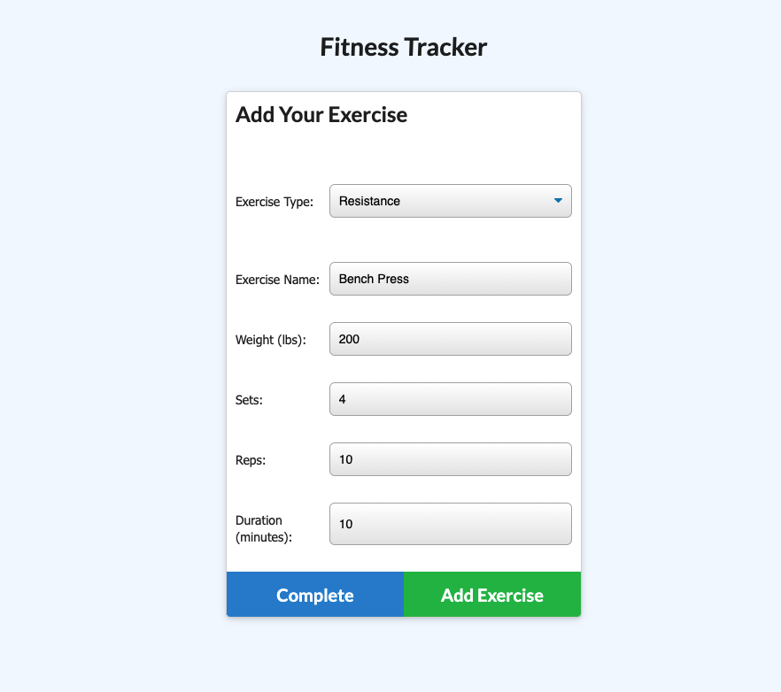
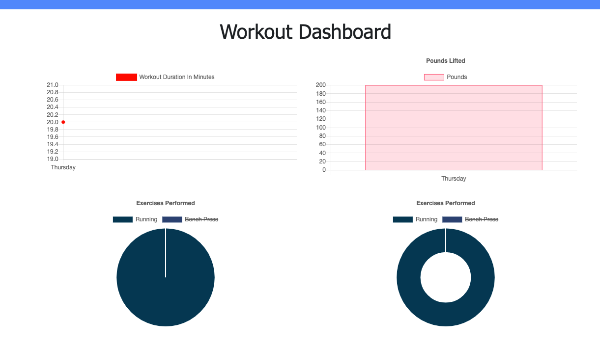

# Workout-Tracker

## Description

* This is a workout tracker application where users can create workouts, record exercises they have done in that workout session and visualize the workout records for the last 7 days with charts.

## User Story

```
As a user, I want to be able to view create and track daily workouts. 
I want to be able to log multiple exercises in a workout on a given day. 
I should also be able to track the name, type, weight, sets, reps, and duration of exercise. 
If the exercise is a cardio exercise, I should be able to track my distance traveled.
```

## Screenshots




## Links

* Heroku Link:https://thawing-lowlands-15735.herokuapp.com/
* GitHub repositories: https://github.com/mengyue-z/Workout-Tracker


